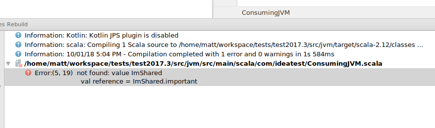

## Steps to reproduce IDEA 2017.3 Regression

There is a regression in IDEA 2017.3 where IDEA doesn't always compile shared sources.  I've made a minimal example that triggers the bug.

1. Make two copies of this repo 

```
git clone git@github.com:mgilbertnz/idea-scalajs-bug.git test2017.2
git clone git@github.com:mgilbertnz/idea-scalajs-bug.git test2017.3
```

2. Test with IDEA 2017.2.  The specific version I am using is:
```
IDEA 2017.2.6
Build #IC-172.4574.11, built on November 14, 2017
```

- New -> Project From Existing Sources
- Import SBT project
- Build -> Rebuild Project
- Build should work fine

Open SBT shell for 2017.2 copy, clean the project and then exit.
```
[test2017.2]$ sbt
[info] Loading settings from plugins.sbt ...
[info] Loading project definition from /home/matt/workspace/tests/test2017.2/project
[info] Loading settings from build.sbt ...
[info] Set current project to test2017-2 (in build file:/home/matt/workspace/tests/test2017.2/)
[info] sbt server started at 127.0.0.1:5183
sbt:test2017-2> clean
[success] Total time: 0 s, completed 10/01/2018 5:05:58 PM
sbt:test2017-2> exit
```

Back in IDEA,
- Build -> Rebuild Project
- Build should work fine


3. Demonstrate failure with IDEA 2017.3.  The specific version I am using is:
```
IDEA 2017.3.2
Build #IC-173.4127.27, built on December 26, 2017
```

- New -> Project From Existing Sources
- Import SBT project
- Build -> Rebuild Project
- Build should work fine

Open SBT shell for 2017.3 copy, clean the project and then exit.
```
[test2017.3]$ sbt
[info] Loading settings from plugins.sbt ...
[info] Loading project definition from /home/matt/workspace/tests/test2017.3/project
[info] Loading settings from build.sbt ...
[info] Set current project to test2017-3 (in build file:/home/matt/workspace/tests/test2017.3/)
[info] sbt server started at 127.0.0.1:4967
sbt:test2017-3> clean
[success] Total time: 0 s, completed 10/01/2018 5:03:53 PM
sbt:test2017-3> exit
```

Back in IDEA 2017.3,
- Build -> Rebuild Project
- Notice the following error


